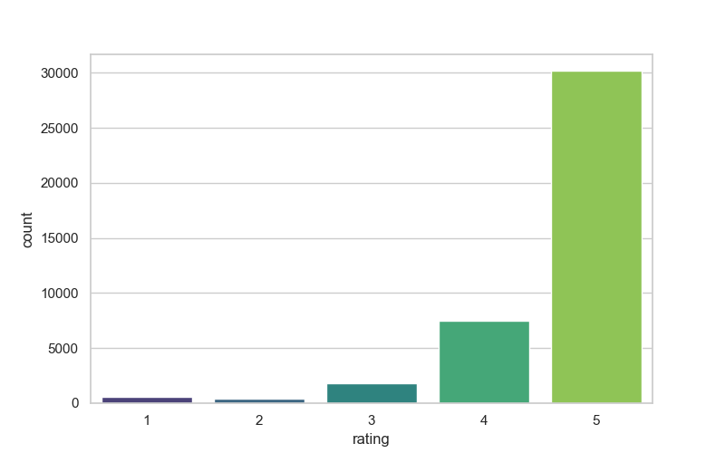
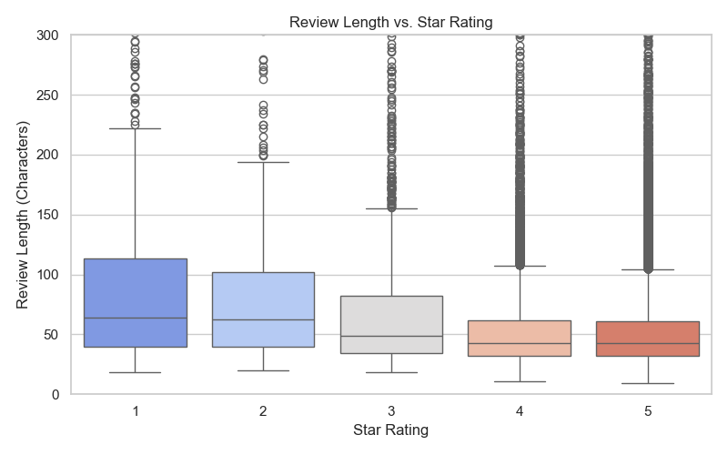
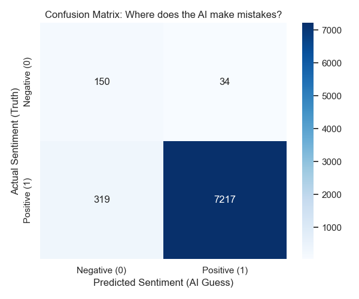
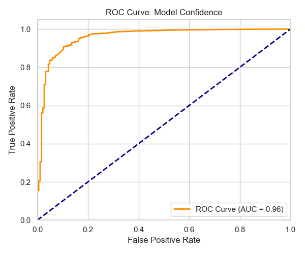
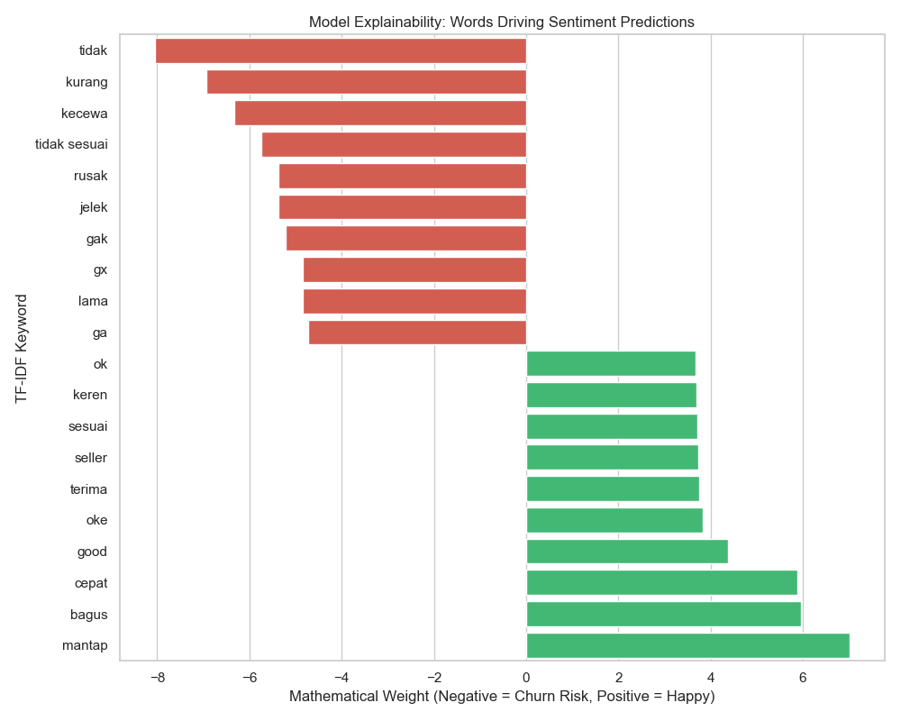
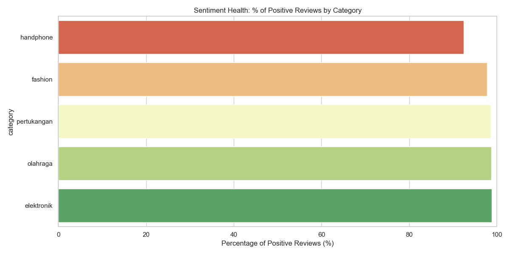
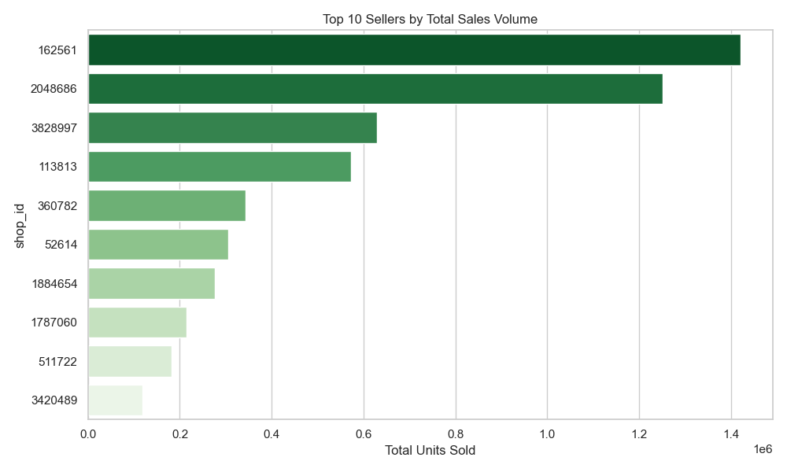
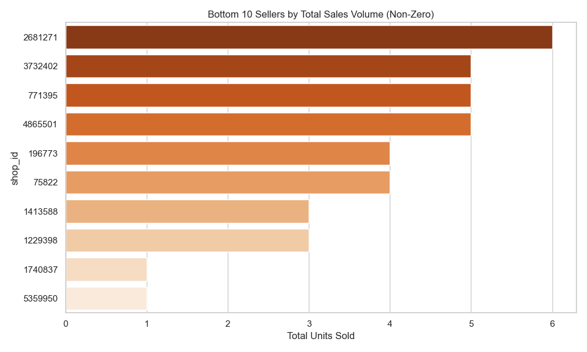

# E-Commerce Voice of Customer (VoC) Intelligence & Seller Ranking System

An end-to-end Data Science pipeline designed to automatically analyze e-commerce product reviews, identify churn-risk customers, extract the root causes of dissatisfaction, and rank seller performance.

---

## The Business Problem: The "Accuracy Paradox"

E-commerce platforms face a significant challenge when analyzing customer feedback. Because the vast majority of online reviews default to 5-stars, simple machine learning models will achieve high overall accuracy by simply ignoring the rare, critical 1-star reviews. However, it is these exact negative reviews that drive customer churn and highlight operational failures.

**The Solution:**
By processing over 40,000 real-world product reviews from Tokopedia, this pipeline:
1. **Identifies Angry Customers:** Engineered a Balanced Logistic Regression model that prioritizes *Recall* over *Accuracy*, successfully catching **82% of all critical negative reviews**.
2. **Diagnoses the Root Cause:** Utilized Unsupervised LDA Topic Modeling and Feature Importance extraction to mathematically prove why customers are upset.
3. **Takes Automated Action:** Developed a proprietary algorithm to generate a **Composite Seller Quality Score**, automatically flagging the platform's top volume drivers versus its biggest operational risks.

---

## The Architecture: Phase-by-Phase Breakdown

### Phase 1: Data Pre-processing & Exploratory Data Analysis (EDA)
Before deploying any machine learning, we analyzed the shape of the data to inform our strategy and cleaned the text using Regular Expressions (lowercasing, removing URLs, handling missing values).

**Insight 1: The Class Imbalance**

As the chart shows, the dataset is overwhelmingly skewed. Over 75% of the reviews are 5-stars. This informed our decision to pivot away from a standard 5-class prediction model toward a **Binary Sentiment model** (Positive vs. Negative) to isolate the churn risk.

**Insight 2: Customer Behavior Mapping**

We discovered a behavioral trend: 5-star reviews tend to be extremely short, while 1-star and 2-star reviews exhibit a "long tail" of extensive, paragraph-length complaints. This confirms that negative reviews contain rich textual data ready for NLP extraction.

### Phase 2: Binary Sentiment "Model Bake-Off"
We tested three different classification algorithms using a TF-IDF Vectorizer to determine the best approach for our highly imbalanced data.

| Model | Overall Accuracy | Sentiment Class | Precision | Recall | F1-Score |
| :--- | :--- | :--- | :--- | :--- | :--- |
| **Logistic Regression (Balanced)** | **95.43%** | **Negative (0)** | 0.32 | **0.82** | 0.46 |
| | | **Positive (1)** | 1.00 | 0.96 | 0.98 |
| **Naive Bayes** | 97.88% | **Negative (0)** | 0.75 | 0.16 | 0.27 |
| **Random Forest** | 97.82% | **Negative (0)** | 0.67 | 0.17 | 0.27 |

**The Verdict:** While Naive Bayes and Random Forest achieved higher overall accuracy (~98%), they failed the business objective by missing almost all of the negative reviews (Recall: ~16%). By explicitly penalizing our Logistic Regression algorithm for missing the minority class (`class_weight='balanced'`), we successfully captured **82% of all negative reviews**.

### Phase 2.5: Deep Dive Model Evaluation & Explainable AI (XAI)
To prove the model's reliability to stakeholders, we generated detailed performance artifacts.

**Where does the AI make mistakes?**

The Confusion Matrix visualization proves we minimized False Negatives (missing an angry customer), which is the most expensive mistake for an e-commerce platform.

**Model Confidence**

An Area Under the Curve (AUC) score approaching 1.0 indicates our model is mathematically stable and highly confident in distinguishing between positive and negative text.

**Why did the AI make that choice?**

This chart provides Explainable AI (XAI). It demonstrates exactly which Indonesian keywords the algorithm mathematically associates with churn risk (Negative Weight) versus satisfaction (Positive Weight).

### Phase 3: Root Cause Extraction (Topic Modeling)
We took the negative reviews flagged by our model and piped them into an **Unsupervised Latent Dirichlet Allocation (LDA)** algorithm. By extracting the top frequency words from the 1-star and 2-star reviews, we clustered the complaints into three actionable business drivers:
1. **Fulfillment/Shipping Delays:** ("dikirim", "lama", "sampai")
2. **Product Mismatches/Wrong Items:** ("salah", "warna", "kecewa")
3. **Quality Control:** ("berfungsi", "kualitas", "rusak")

### Phase 4 & 5: Business Intelligence & Seller Ranking
We translated our NLP findings into actionable metrics. We grouped the data by `shop_id` and calculated a **Composite Seller Score** based on Customer Satisfaction (70% Weight) and Reliability at Scale (30% Weight).

We then exported a suite of Executive Dashboards to summarize the platform's health:

**Sentiment Health by Category**

This visualization highlights exactly which product categories are driving the negative sentiment, allowing managers to target their interventions.

**Top Sellers vs. At-Risk Sellers**
We mapped out the top sellers driving the platform's revenue to ensure VIP merchants are protected, while flagging the worst-performing accounts for audit.

*Top Sellers by Volume:*

*At-Risk Sellers by Volume:*

---

## Tech Stack
* **Language:** Python
* **Data Manipulation:** Pandas, NumPy
* **Machine Learning & NLP:** Scikit-Learn (`LogisticRegression`, `TfidfVectorizer`, `LatentDirichletAllocation`, `MinMaxScaler`)
* **Visualization:** Matplotlib, Seaborn
